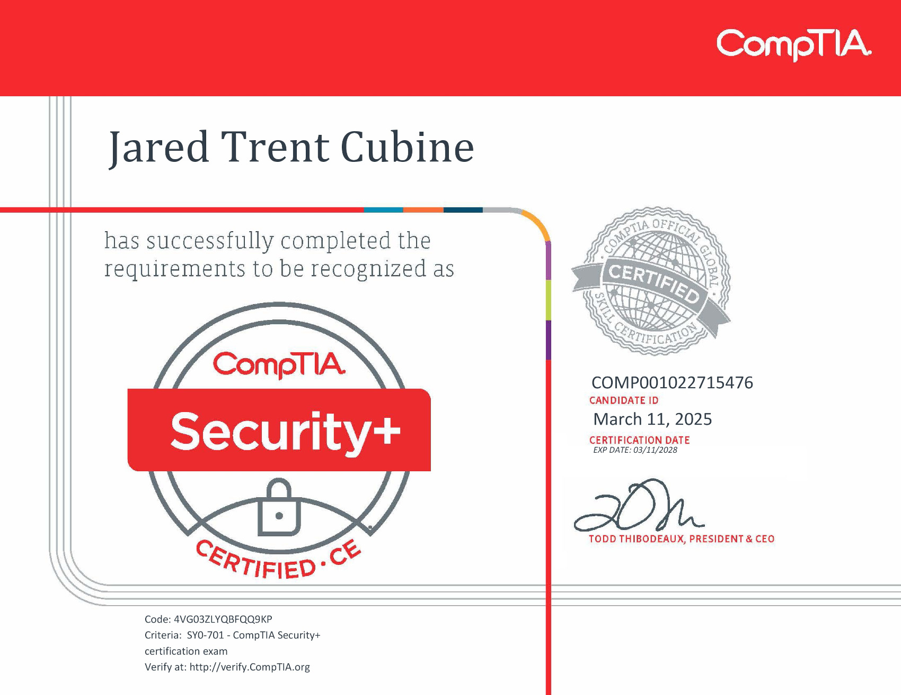

<head> 
<link rel="stylesheet" href="carouselStyle.css">
</head>

  
# About Me  

Welcome to my cyber security portfolio website! I am Trent Cubine, a driven professional with a strong foundation in both web development and cyber security. With a background in web technologies, network security, and threat analysis, I specialize in building secure systems and conducting detailed security analyses.

I have hands-on experience in developing and maintaining secure web environments, most recently as a Digital Producer at Belk, where I worked on e-commerce platforms and digital marketing initiatives. Additionally, my role as a Jr. Web Developer at Mission Wired involved building secure donation websites for clients, optimizing performance, and executing impactful email campaigns.

I am continuously expanding my skills in cyber security through my academic background, including a BA in Mass Communication with a minor in Computer Science, as well as certifications like Google’s Cyber Security Specialization and CompTIA Security+.

In my portfolio, you'll find several projects that showcase my skills in security, such as deploying my own SIEM system using Microsoft Azure and developing a Python-based Wi-Fi sniffer tool for network security analysis.

Explore my work and feel free to reach out to discuss how my expertise can help enhance your organization’s security posture.

  

  

# Social Media Accounts and Platform Links 

[LinkedIn](https://www.linkedin.com/in/trent-cubine-268539110/)  [Try Hack Me](https://tryhackme.com/p/2EZ) [Code Wars](https://www.codewars.com/users/2EZ)

 

# Certifications 

1. Google Cybersecurity Specialization
2. CompTIA Security+ 

  

  

    
    
  

  <button class="prev" onclick="moveSlide(-1)">&#10094;</button>
  <button class="next" onclick="moveSlide(1)">&#10095;</button>

  

# Projects

 

  

### Creating a SIEM in Microsoft Azure leveraging Microsoft Sentinel 

In this project I created a SIEM system in Microsoft Azure by leveraging Microsoft Sentinel. I launched a VM and created a log analytics workspace where I enabled Microsoft Sentinel. I then connected the VM as a data source and created analytic rules to flag specific instances from the VMs logs. 

[You can see my documentation of this project here](Building my own SIEM v3.pdf)

  
  

  

### CISCO Packet Tracer Projects  

I keep a repository of Cisco Packet Tracer Projects I've compleated. Each Project resides in it's own folder with its PKT file and a PDF with the project's goals and background work. In my Cisco Packet Tracer project repository, I showcase a variety of networking designs that demonstrate my proficiency in configuring and troubleshooting networks. These projects cover key concepts such as VLANs, routing protocols, network security, and IP addressing, with real-world applications like designing campus networks and implementing VPNs. Through hands-on experience, I've gained a deep understanding of network design, security, and management, which I’m eager to apply in professional settings. 

[You can see these projects here.](https://github.com/2EZ2break/Packet-Tracer-Projects)

  
  

  

### TryHackMe Progress 

I am currently ranked within the top 200,000 users on the TryHackMe platform, having completed over 33 rooms covering a wide range of cybersecurity topics. This hands-on lab experience has been a critical part of my learning journey, allowing me to develop practical skills in areas such as network security, vulnerability assessment, incident response, and security operations. Each room has helped strengthen my technical knowledge and problem-solving abilities while exposing me to real-world scenarios and tools commonly used by cybersecurity professionals. 

  

  

### Various Python Projects

I maintain a repository of Python scripts focused on cybersecurity and penetration testing. One notable script, wifiSniffer.py, scans Wi-Fi networks within range of a Windows device, extracting key details like signal strength, encryption protocols, and authentication methods. Other scripts like SimplePasswordBruteForce.py demonstrate basic brute-force attack algorithms, while PortScanner.py enumerates a machines ports. For more information on additional scripts, check the ReadMe.txt file in the repository.

[Click here to visit the Repository.](https://github.com/2EZ2break/python-Projects)

  
  
 

# Cyber Content I Love

Darknet Diaries - Sam Bent - Pirate Software - Mental Outlaw - DEFCONconference

  
  

# Hobbies

Video Games - College Football - Formula 1 - Youtube - Chess

  

