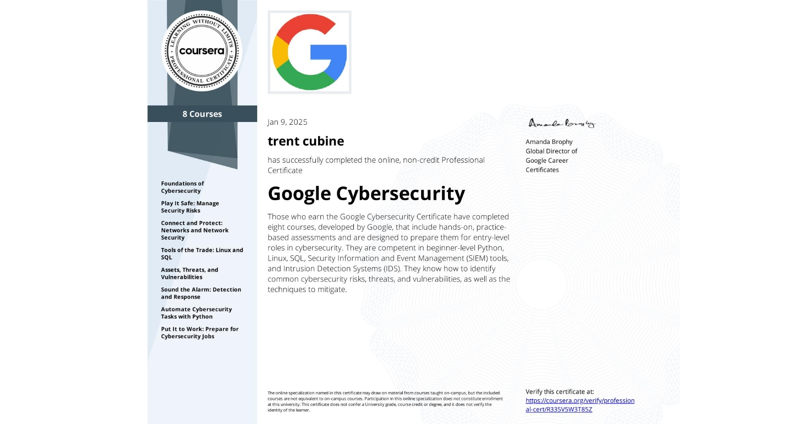

<head> 
<link rel="stylesheet" href="carouselStyle.css">
</head>

  
# About Me  

I'm Trent Cubine, a versatile and motivated professional with a strong foundation in digital production, web development, and technology. With hands-on experience in fast-paced environments, I bring a unique blend of creativity, technical know-how, and problem-solving to every project I take on.

My background includes work as a Digital Producer at Belk, where I supported e-commerce operations and helped coordinate digital marketing initiatives across multiple platforms. I also served as a Jr. Web Developer at Mission Wired, contributing to the development of client-facing websites, optimizing user experiences, and executing high-impact email campaigns.

Whether it's launching digital content, building clean and responsive web pages, collaborating across departments, or troubleshooting technical issues, I thrive at the intersection of strategy, design, and execution.

In this portfolio, you’ll find projects that reflect my adaptability and technical skills—from crafting web experiences to analyzing digital systems. I’m always learning, growing, and eager to contribute to innovative teams that value collaboration and continuous improvement.

Feel free to explore my work and reach out—I'd love to connect and discuss how I can help move your next project forward.
  

  

# Social Media Accounts and Platform Links 

[LinkedIn](https://www.linkedin.com/in/trent-cubine-268539110/)  [Try Hack Me](https://tryhackme.com/p/2EZ) [Code Wars](https://www.codewars.com/users/2EZ)

 

# Certifications 

1. Google Cybersecurity Specialization
2. CompTIA Security+
3. TryHackMe Cyber Security 101 Path 

  

  

    
    
    
  

  <button class="prev" onclick="moveSlide(-1)">&#10094;</button>
  <button class="next" onclick="moveSlide(1)">&#10095;</button>

  

# Projects

 

  

### Creating a SIEM in Microsoft Azure leveraging Microsoft Sentinel 

In this project I created a SIEM system in Microsoft Azure by leveraging Microsoft Sentinel. I launched a VM and created a log analytics workspace where I enabled Microsoft Sentinel. I then connected the VM as a data source and created analytic rules to flag specific instances from the VMs logs. 

[You can see my documentation of this project here](Building my own SIEM v3.pdf)

  
  

  

### CISCO Packet Tracer Projects  

I keep a repository of Cisco Packet Tracer Projects I've compleated. Each Project resides in it's own folder with its PKT file and a PDF with the project's goals and background work. In my Cisco Packet Tracer project repository, I showcase a variety of networking designs that demonstrate my proficiency in configuring and troubleshooting networks. These projects cover key concepts such as VLANs, routing protocols, network security, and IP addressing, with real-world applications like designing campus networks and implementing VPNs. Through hands-on experience, I've gained a deep understanding of network design, security, and management, which I’m eager to apply in professional settings. 

[You can see these projects here.](https://github.com/2EZ2break/Packet-Tracer-Projects)

  
  

  

### TryHackMe Progress 

I am currently ranked within the top 10% of users on the TryHackMe platform. This hands-on lab experience has been a critical part of my learning journey, allowing me to develop practical skills in areas such as network security, vulnerability assessment, incident response, and security operations. Each room has helped strengthen my technical knowledge and problem-solving abilities while exposing me to real-world scenarios and tools commonly used by cybersecurity professionals. 

  

  

### Python Projects

maintain a GitHub repository of Python scripts focused on cybersecurity and penetration testing. One featured script, EtcEnumerator.py, automates the enumeration of critical system configuration files in the /etc/ directory (e.g., /etc/passwd, /etc/os-release, /etc/hostname) to extract valuable system information. More of my projects are available on my GitHub. 

[Click here to visit the Repository.](https://github.com/2EZ2break/python-Projects)

  
  
 

# Cyber Content I Love

Darknet Diaries - Sam Bent - Pirate Software - Mental Outlaw - DEFCONconference

  
  

# Hobbies

Video Games - College Football - Formula 1 - Youtube - Chess

  

